# WalSmart ShopSmart AI - Complete Project Architecture & Workflow

## Project Overview

**ShopSmart AI** is a next-generation, AI-powered e-commerce shopping assistant for Walmart, built for Sparkathon 2025. The application features natural language search, smart recommendations, real-time Q&A, sentiment analysis, and a beautiful glassmorphic UI with Apple-style animations.

---

## 🏗️ Project Structure

```
WalSmart/
├── src/                          # Frontend Next.js application
│   ├── app/                      # Next.js 14 App Router
│   │   ├── api/                  # API route handlers (proxy to AI service)
│   │   │   ├── ai-search/        # AI-powered search endpoint
│   │   │   ├── product-qa/       # Product Q&A endpoint
│   │   │   ├── recommendations/  # Cart-based recommendations
│   │   │   ├── sentiment/        # Review sentiment analysis
│   │   │   └── test-relevance/   # Testing endpoint
│   │   ├── layout.tsx            # Root layout component
│   │   └── actions.ts            # Server actions
│   ├── components/               # React UI components
│   │   └── ui/                   # Reusable UI components (11 components)
│   ├── ai/                       # AI integration layer
│   │   ├── flows/                # Genkit AI flows (11 flows)
│   │   ├── genkit.ts             # Genkit configuration
│   │   └── dev.ts                # Development AI utilities
│   ├── lib/                      # Shared libraries
│   │   ├── data.ts               # Product data (27KB - main data source)
│   │   ├── types.ts              # TypeScript type definitions
│   │   └── utils.ts              # Utility functions
│   └── datasets/                 # Additional datasets (3 files)
│
├── ai-service/                   # Python FastAPI AI backend
│   ├── main.py                   # FastAPI application (17KB - core logic)
│   ├── models.py                 # SQLAlchemy database models
│   ├── database.py               # Database configuration
│   ├── init_db.py                # Database initialization script
│   ├── products.db               # SQLite database (40KB)
│   ├── requirements.txt          # Python dependencies
│   ├── generate_report.py        # Report generation utility
│   ├── update_products.py        # Product update utility
│   └── .env                      # Environment variables (AI API keys)
│
├── project/                      # Legacy/backup project files (34 items)
├── .next/                        # Next.js build output
├── node_modules/                 # Node.js dependencies
├── package.json                  # Frontend dependencies
├── next.config.js                # Next.js configuration
├── tsconfig.json                 # TypeScript configuration
├── tailwind.config.js            # Tailwind CSS configuration
├── postcss.config.js             # PostCSS configuration
├── .env                          # Environment variables (Gemini API)
├── env.example                   # Environment template
├── generate_products.py          # Product data generation script
├── new_products.json             # Generated product data (27KB)
└── README.md                     # Project documentation
```

---

## 🛠️ Technology Stack

### **Frontend** (Next.js 14 Full-Stack)

| Technology | Version | Purpose |
|------------|---------|---------|
| **Next.js** | 14.2.30 | React framework with App Router & API routes |
| **React** | 18.2.0 | UI library |
| **TypeScript** | 5.8.3 | Type-safe JavaScript |
| **Tailwind CSS** | 3.4.17 | Utility-first CSS framework |
| **Framer Motion** | 11.18.2 | Animation library for glassmorphic effects |
| **Lucide React** | 0.292.0 | Icon library |

### **AI Integration** (Dual Approach)

| Technology | Purpose |
|------------|---------|
| **Google Genkit** | 1.14.0 - Firebase AI framework for structured AI flows |
| **@genkit-ai/googleai** | 1.14.0 - Google Gemini API integration |
| **@genkit-ai/firebase** | 1.14.0 - Firebase backend for AI |
| **OpenAI Client** (via OpenRouter) | Alternative AI provider for Python service |

### **Backend AI Service** (Python FastAPI)

| Technology | Version | Purpose |
|------------|---------|---------|
| **FastAPI** | 0.115.4 | High-performance async API framework |
| **Uvicorn** | 0.32.0 | ASGI server |
| **OpenAI SDK** | 1.51.2 | AI API client (via OpenRouter) |
| **SQLAlchemy** | (via models) | ORM for database |
| **SQLite** | - | Product database |
| **HTTPX** | 0.27.2 | Async HTTP client |
| **Python-dotenv** | 1.0.1 | Environment variable management |

### **UI Libraries & Tools**

| Technology | Purpose |
|------------|---------|
| **Radix UI** | Accessible component primitives (Dialog, Label, Progress, Toast) |
| **React Hook Form** | 7.49.2 - Form handling |
| **Zod** | 3.22.4 - Schema validation |
| **Recharts** | 3.0.2 - Data visualization for sentiment |
| **class-variance-authority** | 0.7.1 - Component variant management |
| **tailwind-merge** | 3.3.1 - Tailwind class merging utility |

### **Development Tools**

| Technology | Purpose |
|------------|---------|
| **Vite** | 7.0.2 - Fast build tool |
| **PostCSS** | 8.5.6 - CSS processing |
| **Autoprefixer** | 10.4.21 - CSS vendor prefixing |
| **dotenv** | 17.0.1 - Environment management |

---

## 📦 Complete Dependencies

### **Frontend Dependencies** (`package.json`)

```json
{
  "dependencies": {
    "@genkit-ai/firebase": "^1.14.0",
    "@genkit-ai/googleai": "^1.14.0",
    "@hookform/resolvers": "^3.3.4",
    "@radix-ui/react-dialog": "^1.0.5",
    "@radix-ui/react-label": "^2.1.7",
    "@radix-ui/react-progress": "^1.1.7",
    "@radix-ui/react-toast": "^1.2.14",
    "class-variance-authority": "^0.7.1",
    "firebase-admin": "^13.4.0",
    "framer-motion": "^11.18.2",
    "genkit": "^1.14.0",
    "lucide-react": "^0.292.0",
    "next": "^14.2.30",
    "react": "^18.2.0",
    "react-dom": "^18.2.0",
    "react-hook-form": "^7.49.2",
    "recharts": "^3.0.2",
    "tailwind-merge": "^3.3.1",
    "tailwindcss": "^3.4.17",
    "zod": "^3.22.4"
  },
  "devDependencies": {
    "@types/dotenv": "^6.1.1",
    "@types/node": "20.19.4",
    "@types/react": "^18.3.23",
    "@types/react-dom": "^18.3.0",
    "autoprefixer": "^10.4.21",
    "dotenv": "^17.0.1",
    "postcss": "^8.5.6",
    "typescript": "5.8.3",
    "vite": "^7.0.2"
  }
}
```

### **AI Service Dependencies** (`ai-service/requirements.txt`)

```
fastapi==0.115.4
uvicorn[standard]==0.32.0
python-dotenv==1.0.1
openai==1.51.2
httpx==0.27.2
```

---

## 🔄 How the System Works

### **Architecture Overview**

```mermaid
graph TB
    User[👤 User Browser]
    
    subgraph "Frontend Layer - Next.js :3000"
        UI[React Components<br/>Tailwind + Framer Motion]
        Pages[Next.js App Router]
        API[API Routes<br/>Proxy Layer]
        Data[lib/data.ts<br/>Product Data]
        Genkit[Genkit AI Flows<br/>Firebase Integration]
    end
    
    subgraph "Backend AI Service - FastAPI :8000"
        FastAPI[FastAPI Server<br/>main.py]
        DB[(SQLite DB<br/>products.db)]
        OpenRouter[OpenRouter API<br/>via OpenAI Client]
    end
    
    subgraph "External AI Services"
        Gemini[Google Gemini API<br/>Vertex AI]
        OpenAI[OpenAI Models<br/>GPT-4o-mini]
    end
    
    User --> UI
    UI --> Pages
    Pages --> API
    Pages --> Genkit
    API --> FastAPI
    FastAPI --> DB
    FastAPI --> OpenRouter
    OpenRouter --> OpenAI
    Genkit --> Gemini
    Pages --> Data
    
    style User fill:#e1f5ff
    style UI fill:#fff4e1
    style FastAPI fill:#e8f5e9
    style DB fill:#f3e5f5
    style Gemini fill:#ffe0e0
    style OpenAI fill:#ffe0e0
```



---

## 🎯 Core Features & Data Flow

### **1. AI-Powered Smart Search**

**User Flow:**
```
User enters query → Frontend → Next.js API Route → Python AI Service → OpenAI → Extract keywords → Match products → Return results
```

**Detailed Flow:**

1. **User Input**: User types natural language query (e.g., "ingredients for sushi")
2. **Frontend**: Search component sends POST to `/api/ai-search`
3. **Next.js API Route** (`src/app/api/ai-search/route.ts`):
   - Validates query
   - Forwards to Python service: `http://localhost:8000/ai-search`
4. **Python FastAPI** (`ai-service/main.py` - `/ai-search` endpoint):
   - Uses OpenAI GPT-4o-mini via OpenRouter
   - Extracts 6 relevant product names/keywords
   - Returns JSON: `{"productNames": ["Rice", "Seaweed", ...]}`
5. **Next.js API**: Matches keywords with local products from `lib/data.ts`
6. **Frontend**: Displays matched products with animations

**Key Files:**
- Frontend: `src/app/api/ai-search/route.ts` (40 lines)
- Backend: `ai-service/main.py` lines 196-226 (`/ai-search` endpoint)

---

### **2. Product Q&A with "Know Me" Feature**

**User Flow:**
```
User clicks "Know Me" → Sends question → AI analyzes product context → Returns formatted answer + follow-ups
```

**Detailed Flow:**

1. **User Action**: Clicks "Know Me" button on product card
2. **Frontend**: Opens Q&A modal, sends POST to `/api/product-qa`
3. **Next.js API Route** (`src/app/api/product-qa/route.ts`):
   - Forwards request with product details to `http://localhost:8000/product-qa`
4. **Python FastAPI** (`ai-service/main.py` - `/product-qa` endpoint):
   - **AI Prompt includes**:
     - Product name, description, price, category, sentiment
     - Conversation history
     - User question
   - **Special Logic**:
     - **Relevance Check**: Detects irrelevant questions (e.g., "Who is president?")
     - **Markdown Formatting**: Returns formatted answers with bold/italic
     - **Recipe Support**: Provides step-by-step guides
     - **Sentiment Integration**: References review scores
   - **Response Format**:
     ```json
     {
       "answer": "Formatted markdown answer",
       "suggestedProduct": "Alternative product if irrelevant",
       "followUpQuestions": ["Q1", "Q2", "Q3"]
     }
     ```
   - **Follow-up Generation**: Separate AI call generates 2-3 contextual questions
5. **Frontend**: Displays answer with follow-up quick buttons

**Key Features:**
- Conversation history tracking
- Irrelevant question handling with product suggestions
- Dynamic follow-up questions
- Markdown rendering

**Key Files:**
- Frontend: `src/app/api/product-qa/route.ts`
- Backend: `ai-service/main.py` lines 41-147 (`ProductQARequest`, `/product-qa`)

---

### **3. Intent Detection & Recipe Search**

**User Flow:**
```
User searches "make sushi" → AI detects recipe intent → Fetches ingredients from DB → Returns recipe + product matches
```

**Detailed Flow:**

1. **User Input**: Searches for recipe (e.g., "how to make pasta")
2. **Frontend**: Calls `/detect-intent` endpoint
3. **Python FastAPI** (`ai-service/main.py` - `/detect-intent` endpoint):
   - **Fetches product list from SQLite DB** (up to 500 products)
   - **AI Analysis** with context:
     - Determines intent type: `recipe`, `skincare`, `clothing`, `electronics`, `grocery`, `product`
     - Extracts keywords
     - **FOR RECIPES**: Maps recipe ingredients to actual available products
       - Example: "chicken" → "Fresh Chicken Breast" from DB
     - Detects price range, skin type (skincare), category
   - **Response**:
     ```json
     {
       "type": "recipe",
       "keywords": ["sushi", "roll"],
       "ingredients": ["Sushi Rice", "Nori Seaweed Sheets", "Rice Vinegar"],
       "category": "Pantry"
     }
     ```
4. **Frontend**: 
   - If `type === "recipe"`, calls `/recipe-details` for full recipe
   - Displays recipe card with ingredients and steps
   - Shows matching products from cart

**Recipe Details Generation** (`/recipe-details`):
- AI generates:
  - Recipe name
  - Description
  - Ingredients with quantities
  - Step-by-step instructions
  - Prep time and servings

**Key Files:**
- Backend: `ai-service/main.py` lines 296-357 (`/detect-intent`)
- Backend: `ai-service/main.py` lines 372-443 (`/recipe-details`)
- Database: `ai-service/database.py` (SQLAlchemy setup)
- Models: `ai-service/models.py` (Product schema)

---

### **4. Smart Cart Recommendations**

**User Flow:**
```
User adds items to cart → AI analyzes cart → Suggests complementary products
```

**Detailed Flow:**

1. **Trigger**: Cart updates (items added/removed)
2. **Frontend**: Sends cart contents to `/api/recommendations`
3. **Next.js API Route**: Forwards to `http://localhost:8000/recommend`
4. **Python FastAPI** (`ai-service/main.py` - `/recommend` endpoint):
   - Summarizes cart items with categories
   - Prompt: "Suggest 5 complementary products"
   - AI returns product names/keywords
5. **Frontend**: Matches keywords with local products & displays recommendations

**Key Files:**
- Backend: `ai-service/main.py` lines 230-264 (`/recommend`)

---

### **5. Sentiment Analysis & Review Scoring**

**User Flow:**
```
User writes review → AI analyzes sentiment → Updates product scores
```

**Detailed Flow:**

1. **User Action**: Submits product review
2. **Frontend**: Sends review text + current sentiment to `/api/sentiment`
3. **Python FastAPI** (`ai-service/main.py` - `/analyze-review` endpoint):
   - **Input**: Review text + current sentiment scores
   - **AI Analysis**: Updates:
     - Positive/Negative percentages (sum = 100)
     - Aspect scores (quality, value, durability, etc.) 0-100
   - **Returns updated sentiment object**
4. **Frontend**: 
   - Displays updated sentiment bars (Recharts visualization)
   - Shows aspect breakdown

**Sentiment Structure:**
```json
{
  "positive": 75,
  "negative": 25,
  "aspects": {
    "quality": 80,
    "value": 70,
    "durability": 85
  }
}
```

**Key Files:**
- Backend: `ai-service/main.py` lines 150-193 (`/analyze-review`)
- Frontend: Recharts components for visualization

---

## 🗄️ Database Architecture

### **SQLite Database** (`ai-service/products.db`)

**Schema** (from `ai-service/models.py`):

```python
class Product(Base):
    __tablename__ = "products"
    
    id = Column(String, primary_key=True, index=True)
    name = Column(String, index=True)
    description = Column(String)
    longDescription = Column(String)
    price = Column(Float)
    image = Column(String)
    category = Column(String, index=True)  # Indexed for fast filtering
    sentiment = Column(JSON)  # Stored as JSON object
    dataAiHint = Column(String)  # AI search hints
    tags = Column(JSON)  # Array of tags
```

**Database Initialization** (`ai-service/init_db.py`):

1. Extracts products from `src/lib/data.ts` (TypeScript file)
2. Parses TypeScript object syntax using regex
3. Converts to Python dictionaries
4. Inserts into SQLite database
5. Creates indexes on `id`, `name`, and `category`

**Usage:**
- AI service queries DB via SQLAlchemy ORM
- Provides available products for intent detection
- Fast category-based filtering
- Supports ~100+ products efficiently

---

## 🔐 Environment Variables

### **Frontend** (`.env`)
```bash
GEMINI_API_KEY=your-gemini-api-key  # For Genkit AI flows
```

### **AI Service** (`ai-service/.env`)
```bash
OPEN_AI_API_KEY=your-openrouter-api-key  # For OpenAI via OpenRouter
```

**Note**: The project uses **two AI providers**:
1. **Gemini** (via Genkit) - Frontend AI flows
2. **OpenAI GPT-4o-mini** (via OpenRouter) - Backend AI service

---

## 🚀 Running the Application

### **Prerequisites**
```bash
# Node.js 20+ and npm
# Python 3.9+
```

### **Frontend Setup**

```bash
# 1. Install dependencies
npm install

# 2. Set environment variables
cp env.example .env
# Edit .env and add GEMINI_API_KEY

# 3. Run development server
npm run dev
# Opens at http://localhost:3000
```

### **AI Service Setup**

```bash
# 1. Navigate to ai-service
cd ai-service

# 2. Create virtual environment
python -m venv .venv
source .venv/bin/activate  # On Mac/Linux
# .venv\Scripts\activate  # On Windows

# 3. Install dependencies
pip install -r requirements.txt

# 4. Set environment variables
# Create .env file with OPEN_AI_API_KEY

# 5. Initialize database (first time only)
python init_db.py

# 6. Run FastAPI server
uvicorn main:app --reload --port 8000
# Opens at http://localhost:8000
```

### **Full Application Startup**

**Terminal 1** (Frontend):
```bash
npm run dev
```

**Terminal 2** (AI Service):
```bash
cd ai-service
source .venv/bin/activate
uvicorn main:app --reload --port 8000
```

**Access**:
- Frontend: `http://localhost:3000`
- AI Service API Docs: `http://localhost:8000/docs` (Swagger UI)

---

## 🌐 API Endpoints Reference

### **Next.js API Routes** (Proxy Layer)

| Endpoint | Method | Purpose | Backend Target |
|----------|--------|---------|----------------|
| `/api/ai-search` | POST | Smart search | `http://localhost:8000/ai-search` |
| `/api/product-qa` | POST | Product Q&A | `http://localhost:8000/product-qa` |
| `/api/recommendations` | POST | Cart suggestions | `http://localhost:8000/recommend` |
| `/api/sentiment` | POST | Review analysis | `http://localhost:8000/analyze-review` |
| `/api/test-relevance` | POST | Testing endpoint | - |

### **Python FastAPI Endpoints**

| Endpoint | Method | Request Body | Response | AI Model Used |
|----------|--------|--------------|----------|---------------|
| `/ai-search` | POST | `{query: string}` | `{productNames: string[]}` | GPT-4o-mini |
| `/product-qa` | POST | `{query, product, history}` | `{answer, followUpQuestions, suggestedProduct}` | GPT-4o-mini |
| `/recommend` | POST | `{cart: object[]}` | `{productNames: string[]}` | GPT-4o-mini |
| `/analyze-review` | POST | `{reviewText, currentSentiment}` | `{positive, negative, aspects}` | GPT-4o-mini |
| `/detect-intent` | POST | `{query}` | `{type, keywords, ingredients, ...}` | GPT-4o-mini |
| `/recipe-details` | POST | `{query}` | `{name, ingredients, steps, ...}` | GPT-4o-mini |
| `/products` | GET | - | `Product[]` | Database query |

---

## 🎨 UI/UX Features

### **Design System**
- **Framework**: Tailwind CSS with custom configuration
- **Animations**: Framer Motion for smooth transitions
- **Style**: Glassmorphic UI with backdrop blur effects
- **Icons**: Lucide React (modern icon library)
- **Responsive**: Mobile-first design

### **Component Architecture**
- **UI Components** (`src/components/ui/`):
  - Radix UI primitives (accessible, unstyled)
  - Custom styled with Tailwind
  - 11 reusable components

### **Key UX Patterns**
1. **Apple-style animations**: Smooth page transitions
2. **Glassmorphism**: Translucent cards with blur
3. **Progressive disclosure**: Expandable product details
4. **Optimistic UI**: Instant feedback before API responses
5. **Loading states**: Skeleton screens and spinners

---

## 📊 Data Flow Summary


---

## 🔧 Configuration Files

### **Next.js Configuration** (`next.config.js`)
```javascript
module.exports = {
  images: {
    domains: ["images.unsplash.com"],  // Allow external images
  },
};
```

### **TypeScript Configuration** (`tsconfig.json`)
```json
{
  "compilerOptions": {
    "baseUrl": "src",
    "paths": {
      "@/*": ["*"]  // Absolute imports from src/
    },
    "jsx": "preserve",
    "module": "esnext",
    "moduleResolution": "bundler"
  }
}
```

### **Tailwind Configuration** (`tailwind.config.js`)
- Custom color palette
- Extended animations
- Glassmorphic utilities

---

## 🧠 AI Service Architecture

### **OpenAI Client Configuration** (`ai-service/main.py`)

```python
from openai import OpenAI

client = OpenAI(
    base_url="https://openrouter.ai/api/v1",
    api_key=os.getenv("OPEN_AI_API_KEY")
)

# All AI calls use:
model="openai/gpt-4o-mini"
response_format={"type": "json_object"}  # Structured JSON responses
```

**Why OpenRouter?**
- Single API for multiple AI models
- Cost-effective GPT-4o-mini access
- JSON mode support
- Reliable uptime

### **CORS Configuration**
```python
app.add_middleware(
    CORSMiddleware,
    allow_origins=[
        "http://localhost:5173",  # Vite
        "http://localhost:3000",  # Next.js
    ],
    allow_credentials=True,
    allow_methods=["*"],
    allow_headers=["*"],
)
```

---

## 📝 Key Scripts & Utilities

### **Product Generation** (`generate_products.py`)
- Generates mock product data
- Creates `new_products.json` (27KB)
- Includes realistic descriptions, prices, categories

### **Database Utilities**
1. **`init_db.py`**: Initialize SQLite database from TypeScript data
2. **`update_products.py`**: Update existing products
3. **`generate_report.py`**: Generate product report markdown

---

## 🎯 Critical Integration Points

### **1. Frontend ↔ Next.js API Routes**
- **Protocol**: HTTP POST with JSON
- **Authentication**: None (local dev)
- **Error Handling**: Try-catch with user-friendly messages

### **2. Next.js API ↔ Python AI Service**
- **Protocol**: HTTP REST API
- **Port**: 8000
- **Format**: JSON request/response
- **Error Handling**: 502 Bad Gateway if AI service down

### **3. Python AI Service ↔ OpenAI**
- **Provider**: OpenRouter
- **Model**: GPT-4o-mini
- **Format**: Structured JSON mode
- **Rate Limiting**: Handled by OpenRouter

### **4. Python AI Service ↔ SQLite DB**
- **ORM**: SQLAlchemy
- **Connection**: Session dependency injection
- **Queries**: Optimized with indexes

---

## 🚨 Common Issues & Solutions

### **Issue**: AI service not responding
**Solution**: 
```bash
# Check if FastAPI is running
curl http://localhost:8000/products

# Restart service
cd ai-service
uvicorn main:app --reload --port 8000
```

### **Issue**: Database empty
**Solution**:
```bash
cd ai-service
python init_db.py
```

### **Issue**: API key errors
**Solution**:
- Check `.env` files exist in both root and `ai-service/`
- Verify API keys are valid
- Restart both servers after updating `.env`

---

## 📈 Performance Considerations

### **Frontend Optimizations**
- Next.js automatic code splitting
- Image optimization via Next.js Image component
- Client-side caching of product data
- Lazy loading components

### **Backend Optimizations**
- FastAPI async/await support
- SQLite indexed queries
- Connection pooling via SQLAlchemy
- JSON response caching potential

### **AI Call Optimizations**
- Structured JSON mode (faster parsing)
- GPT-4o-mini (cost-effective, fast)
- Prompt engineering for concise responses
- Rate limiting on frontend (debouncing)

---

## 🎓 Learning Resources

### **Technologies to Study**
1. **Next.js 14 App Router**: [nextjs.org/docs](https://nextjs.org/docs)
2. **FastAPI**: [fastapi.tiangolo.com](https://fastapi.tiangolo.com)
3. **Genkit AI**: [firebase.google.com/docs/genkit](https://firebase.google.com/docs/genkit)
4. **Tailwind CSS**: [tailwindcss.com](https://tailwindcss.com)
5. **Framer Motion**: [framer.com/motion](https://www.framer.com/motion/)

### **AI Integration Patterns**
- Structured JSON responses
- Prompt engineering for e-commerce
- Conversation history management
- Intent classification
- Sentiment analysis

---

## 🎉 Summary

**WalSmart ShopSmart AI** is a sophisticated full-stack application combining:

1. **Frontend**: Next.js 14 with React, TypeScript, and Tailwind
2. **AI Layer**: Dual AI providers (Gemini via Genkit + OpenAI via FastAPI)
3. **Backend**: Python FastAPI with SQLite database
4. **Features**: Smart search, product Q&A, recipes, recommendations, sentiment analysis
5. **UI/UX**: Glassmorphic design with Apple-style animations

**Data Flow**: User → React UI → Next.js API Routes → Python FastAPI → OpenAI/DB → Response chain back to user

**Key Strength**: Separation of concerns with Next.js handling UI/routing and Python handling AI-intensive operations with database access.
